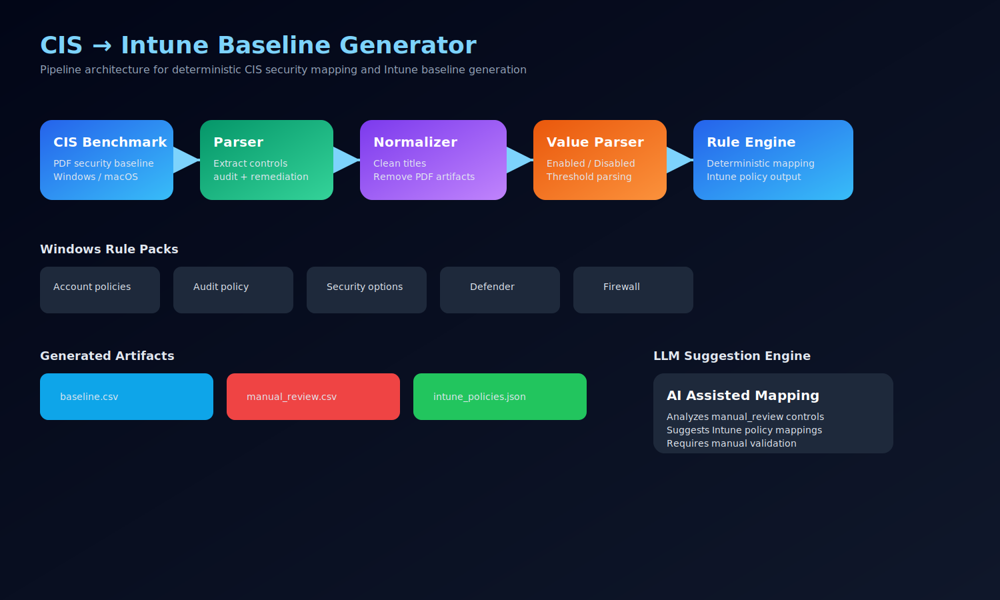
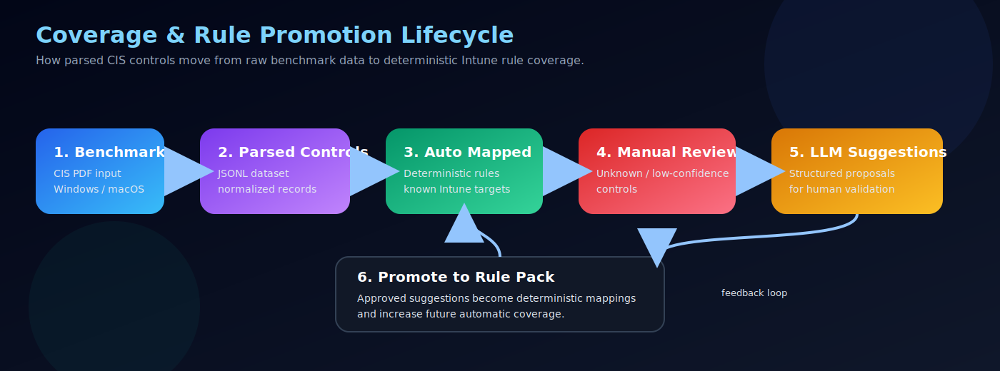

# cis-pdf2csv
### CIS Benchmark Parser & Intune Baseline Generator


Convert **CIS Benchmark PDFs** into structured data and generate **Microsoft Intune baseline configurations**.

The project provides a hybrid architecture combining:

- deterministic security mapping logic
- structured CIS parsing
- rule‑based Intune policy generation
- optional LLM‑assisted mapping suggestions

---

# Architecture

The following pipeline shows how CIS benchmarks are transformed into Intune baseline artifacts.





---

# Key Features

### CIS Benchmark Parsing
Extract structured controls from CIS benchmark PDFs.

Fields extracted:

- control_id
- title
- description
- audit instructions
- remediation steps
- default values
- benchmark metadata
- page references

Output format:

```
JSONL (one control per line)
```

---

# Example Mapping (CIS → Intune)

Example CIS control:

```
CIS Control ID: 2.3.7.3
Title: Interactive logon: Do not display last signed-in
Recommendation: Enabled
```

Resulting Intune mapping:

| Field | Value |
|------|------|
| Implementation | Settings Catalog |
| Intune Area | Local Policies / Security Options |
| Setting Name | Interactive logon: Do not display last signed-in |
| Value | Enabled |
| Value Type | Boolean |
| Source | Deterministic Rule Pack |

Example JSON output:

```json
{
  "cis_id": "2.3.7.3",
  "implementation_type": "settings_catalog",
  "intune_area": "Local Policies/Security Options",
  "setting_name": "Interactive logon: Do not display last signed-in",
  "value_kind": "boolean",
  "value": true
}
```

---

### Deterministic Intune Baseline Generation

A rule‑based mapping engine converts CIS controls into **Intune configuration recommendations**.

The mapping engine contains:

- value normalization
- CIS recommendation parsing
- rule packs per control family
- deterministic policy resolution

---

### LLM Assisted Mapping

Controls that cannot be mapped deterministically are optionally sent to an **LLM fallback engine**.

The model proposes structured mappings which can later be reviewed and promoted to permanent rules.

LLM output example:

```json
{
  "implementation_type": "settings_catalog",
  "intune_area": "Local Policies/Security Options",
  "setting_name": "Interactive logon: Do not display last signed-in",
  "value_kind": "boolean",
  "value": true,
  "confidence": 0.83
}
```

The LLM assists rule development but **never replaces deterministic mappings**.

---

# Architecture

```
CIS Benchmark PDF
        │
        ▼
   CIS Parser
        │
        ▼
  JSONL Controls
        │
        ▼
     Normalizer
        │
        ▼
   Value Parser
        │
        ▼
   Rule Engine
        │
        ├── mapped controls
        │
        └── manual review
                │
                ▼
         LLM Suggestion Engine
                │
                ▼
      suggested_mappings.jsonl
```

---

# Repository Structure

```
src/
 └─ cis_pdf2csv/
      ├─ parser.py
      ├─ cli.py
      └─ intune_mapper/
           ├─ cli.py
           ├─ resolver.py
           ├─ normalizer.py
           ├─ value_parser.py
           ├─ exporters.py
           ├─ llm_fallback.py
           └─ rules/
                └─ windows_server/
                     ├─ account_policies.py
                     ├─ audit_policy.py
                     ├─ security_options.py
                     ├─ defender.py
                     ├─ firewall.py
                     ├─ credential_protection.py
                     ├─ event_log.py
                     └─ remote_access.py
```

---

# Supported CIS Benchmarks

Currently implemented:

- Windows Server 2025

Architecture prepared for:

- Windows Server 2016
- Windows Server 2019
- Windows Server 2022
- Windows 10 / 11
- Apple macOS

---

# Installation

Clone repository

```
git clone https://github.com/koensmink/cis-pdf2csv.git
cd cis-pdf2csv
```

Install dependencies

```
pip install -e .
```

---

# Usage

## Parse CIS Benchmark

```
python -m cis_pdf2csv.cli benchmark.pdf -o controls.jsonl
```

Output:

```
controls.jsonl
```

---

## Generate Intune Baseline

```
python -m cis_pdf2csv.intune_mapper.cli controls.jsonl -o intune_out
```

Output directory:

```
intune_out/
```

Generated artifacts:

| File | Description |
|-----|-------------|
| baseline.csv | proposed Intune baseline |
| manual_review.csv | controls needing review |
| intune_policies.json | structured policy data |
| suggested_mappings.jsonl | LLM mapping suggestions |

---

# Container Usage

Build container:

Docker

```
docker build -t cis-pdf2csv .
```

Podman

```
podman build -t cis-pdf2csv .
```

Run parser:

```
podman run --rm -v "${PWD}:/work:Z" -w /work cis-pdf2csv python -m cis_pdf2csv.cli benchmark.pdf -o controls.jsonl
```

Run mapper:

```
podman run --rm -v "${PWD}:/work:Z" -w /work cis-pdf2csv python -m cis_pdf2csv.intune_mapper.cli controls.jsonl -o intune_out
```

Enable LLM suggestions:

```
podman run --rm -e OPENAI_API_KEY=$OPENAI_API_KEY -v "${PWD}:/work:Z" -w /work cis-pdf2csv python -m cis_pdf2csv.intune_mapper.cli controls.jsonl -o intune_out --llm-fallback
```

---

## Enable LLM Suggestions

```
python -m cis_pdf2csv.intune_mapper.cli controls.jsonl -o intune_out --llm-fallback
```

Environment variable required:

```
OPENAI_API_KEY=your_api_key
```

---

# Example Workflow

```
1. Download CIS Benchmark PDF
2. Parse PDF → JSONL dataset
3. Run Intune mapper
4. Review manual_review.csv
5. Review suggested_mappings.jsonl
6. Promote accepted suggestions to rule packs
```

---

# Design Principles

### Deterministic First

Baseline generation must be reproducible.

Rule packs remain the primary mapping method.

### AI Assisted Engineering

LLM suggestions accelerate rule creation but do not replace deterministic logic.

### Reviewable Output

All mappings are exported as structured artifacts that can be reviewed and audited.

---

# Development Roadmap

Planned improvements:

- Windows Server shared rule packs (2016‑2025)
- macOS CIS mapping
- Windows 11 workstation baseline
- Intune Settings Catalog metadata integration
- Microsoft Graph API policy deployment
- Policy template generation
- Coverage metrics per benchmark

---

# License

MIT License
